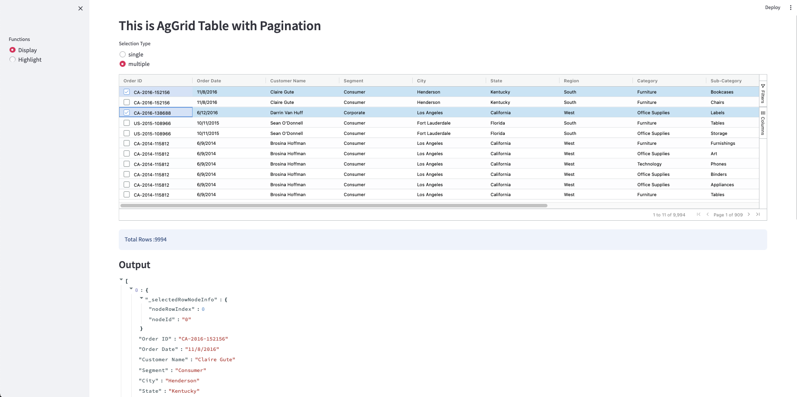

### References : 
components streamlit : --> https://components.streamlit.app

### Begin Project:

    ❯ cd <foldername-projects>

    ❯ python -m venv venv

    ❯ source ./venv/bin/activate

    ❯ pip install streamlit

    ❯ pip install streamlit-option-menu

 
### another packages for single compilations

    ❯ pip install opencv-python

    ❯ pip install qrcode

    ❯ pip install streamlit-aggrid

### menjalankan project:

    ❯ streamlit run ./<nama-file>.py  --server.port 8888

---

    

